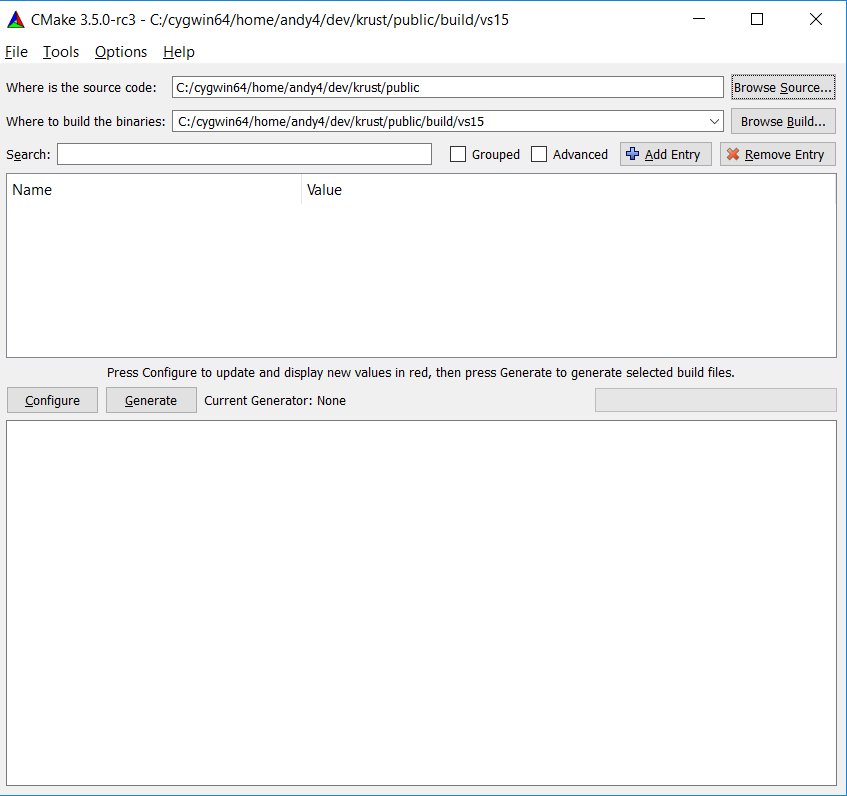
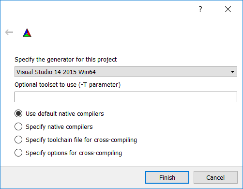
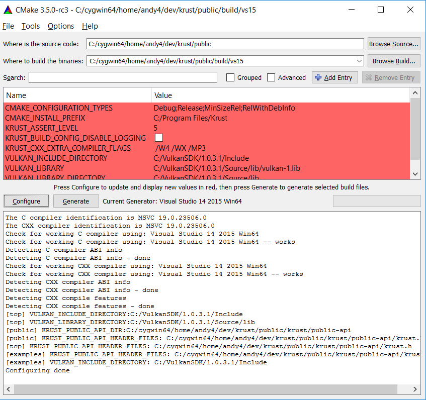
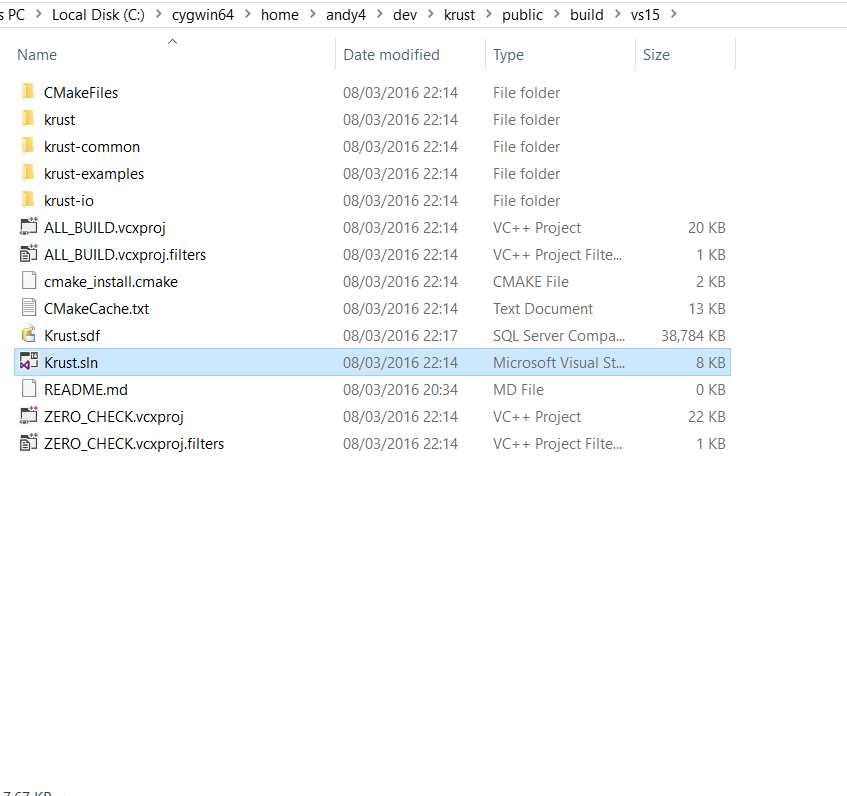
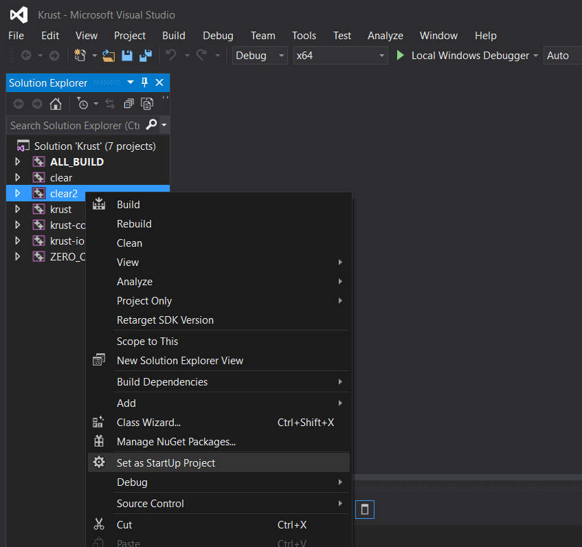
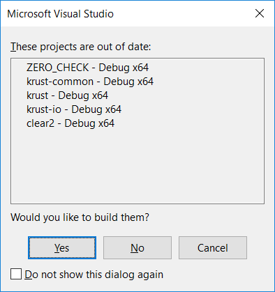
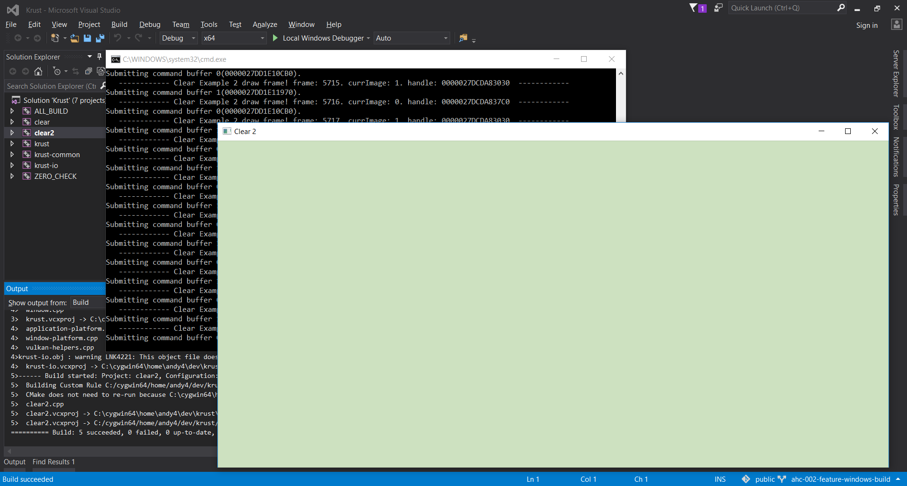

Building Krust
==============

Krust comes with a CMake build system.

On Linux
--------

For a debug makefile build do the following:

       cd build/debug
       ccmake ../../
       # press "c" to configure
       # Set VULKAN_INCLUDE_DIRECTORY and VULKAN_LIBRARY_DIRECTORY
       # to locations in which you have a Vulkan SDK.
       # press "g" to generate
       make.

On Windows
----------

**The Windows platform is currently broken**. Use Linux for now.

The easiest way to build Krust for Windows is to use CMake to generate a
Visual Studio solution that you can use in Visual Studio 2015 Community Edition.

* Download and install Vulkan Drivers from your GPU manufacturer.
* Download and install the Vulkan SDK from https://vulkan.lunarg.com/.
  Note, you do not have to sign-in. Just click the Windows link below the
  sign-in form.
* Download Visual Studio 2015 Community Edition from
  https://www.visualstudio.com/en-us/products/visual-studio-community-vs.aspx
* Download and install CMake for Windows from https://cmake.org/download/
* Run cmakegui to configure and generate native Visual Studio project files.
  * Set the input path to where Krust is checked out and the output path to
    wherever you want to build the library (e.g., _project-root_/build/vs15)
    
  * Hit the configure button and select "Visual Studio 14 2015 Win64" as the
    generator from the dialog box which pops up.
    
  * This should find your Vulkan SDK and display a set of build variables.
    
    Modify any that you need to (for example, change /MP3 to /MPX to change the
    parallelism of the build, where X is your number of cores multiplied
    by 1.5). Hit the configure button again to commit to them.
  * Hit generate to spit out a Visual Studio solution and projects.
* Use FileExplorer to browse to the CMakeGUI output directory.
  
* Click on `Krust.sln` to open Visual Studio.
* Right-click on `clear2` in the solution explorer and then click "Set as
  Startup Project".
  
* On the keyboard enter `CTRL-F5` and click yes in the dialogue box which pops
  up.
  

The projects should now build and you should be looking at the clear2 example
running:

Configuration Variables
=======================

Define these from the build system to affect how Krust is built.

KRUST_ASSERT_LEVEL
------------------
A number in the range 1 to 5. The higher the number, the more assertions
will be fired and the more expensive they will be.
Do debug builds at 5.
Deploy a true release at level 0 (no assertions).
Consider doing release builds at > 0 before deployment.

* DEFAULT: 5

KRUST_BUILD_CONFIG_DISABLE_LOGGING
----------------------------------
If defined, Krust logging code will compile down to nothing or to very little.

* DEFAULT: Not defined.
