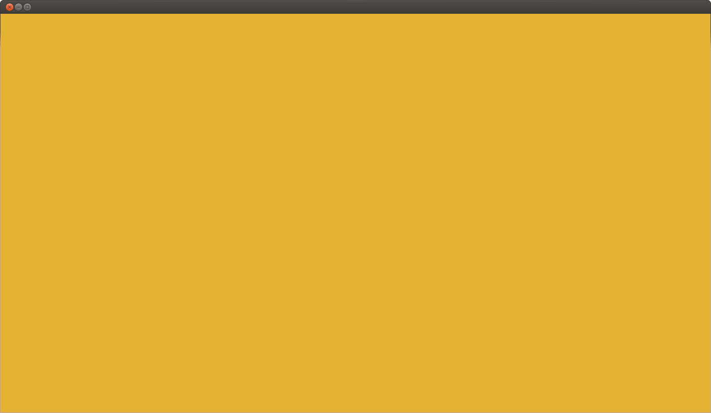

# Tutorial Template



If you copy this example to start your own, please consider writing a tutorial
explaining how you did it in this file.

Markdown is super simple. Read more on
[plain Markdown](http://daringfireball.net/projects/markdown/)
and [Markdown Extra](https://michelf.ca/projects/php-markdown/extra/)
if interested, but there is everything you need in this file (headings, images,
listings, and links).

# Heading 1

## Heading 2

Listing:

```cpp
void printLotsOfInts()
{
  for(int i = 0; i < MAX_INT; ++i )
  {
    printf("i = %d\n", i);
  }
}
```
