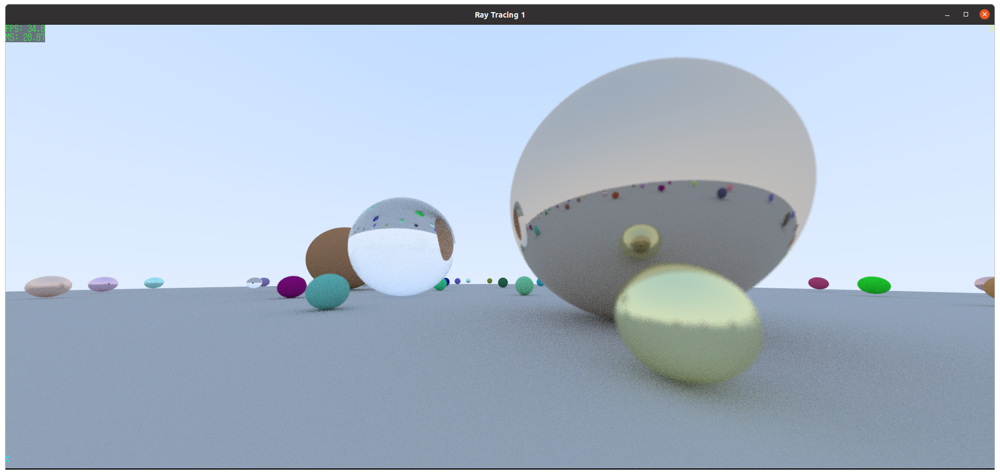
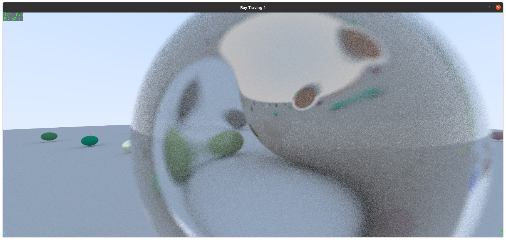
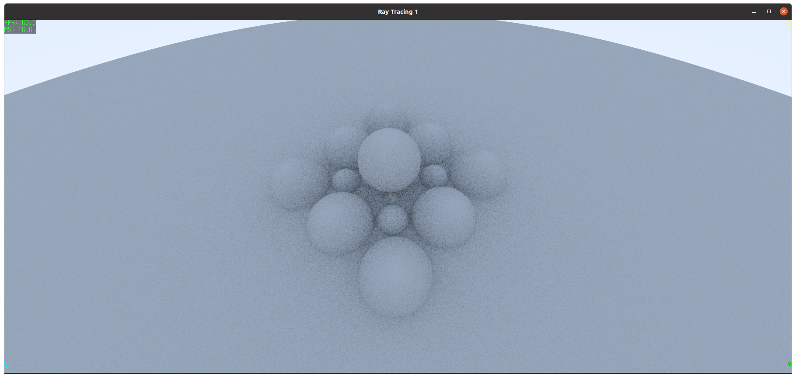
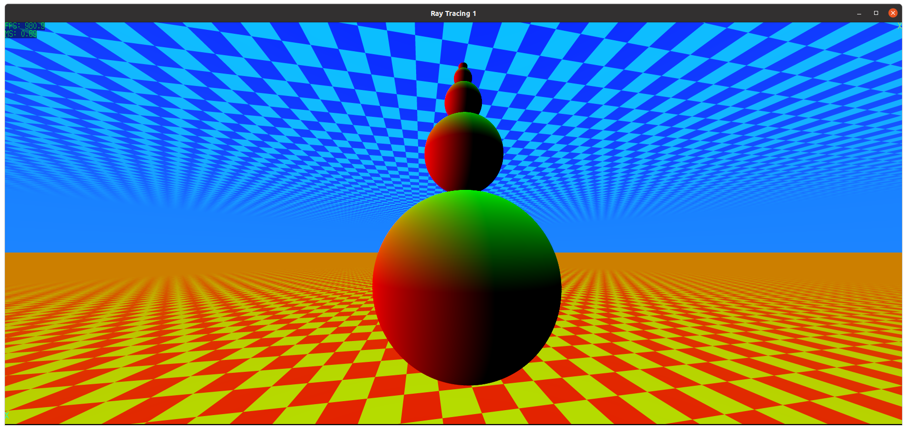
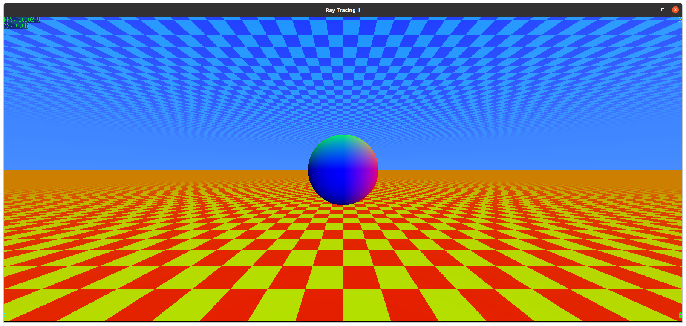

# Compute Shader Ray Tracing Example 1

Runs a simple compute shader directly on swapchain images, binding them as
storage images.
The shader ray traces a simple scene.
Left-clicking the left button and dragging the mouse allows first-person camera control. The WSAD(QE) keys allow translating the camera position.
